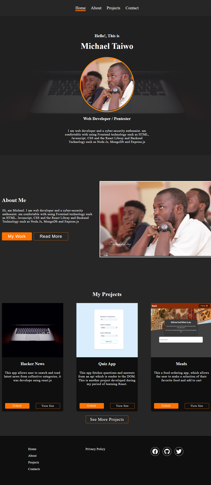
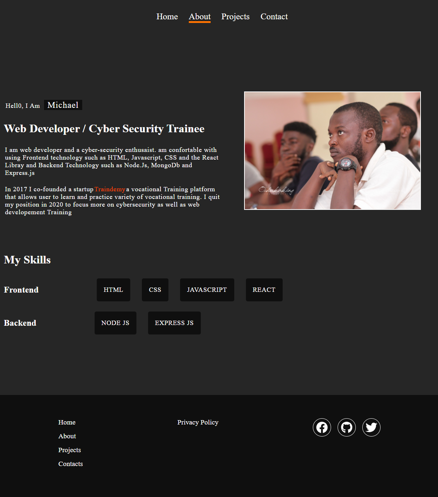
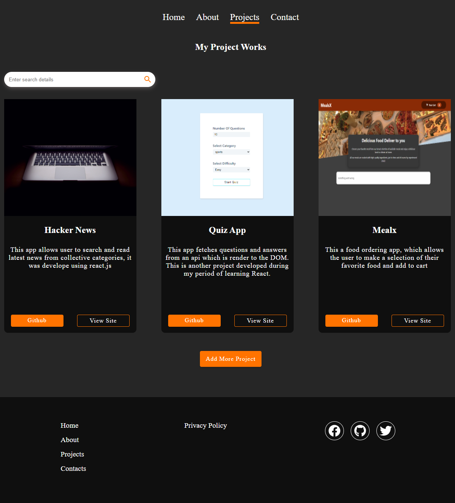
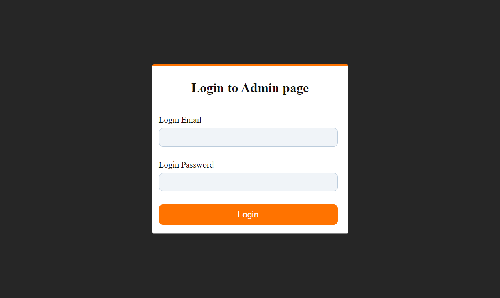
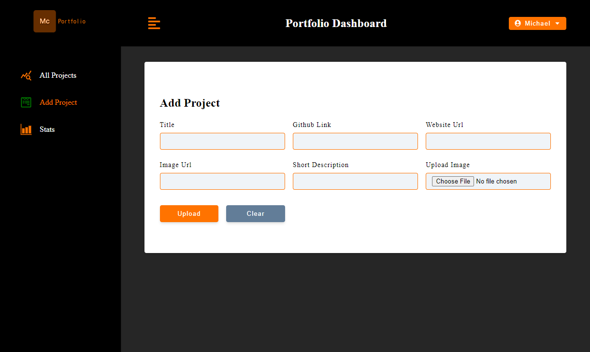
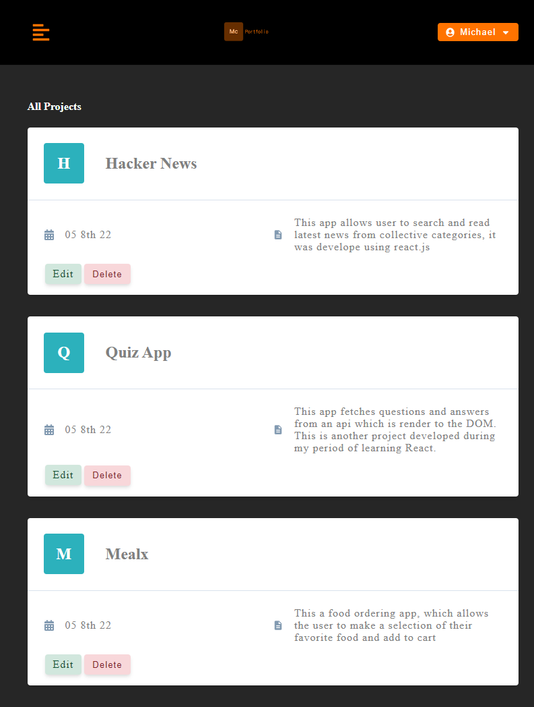
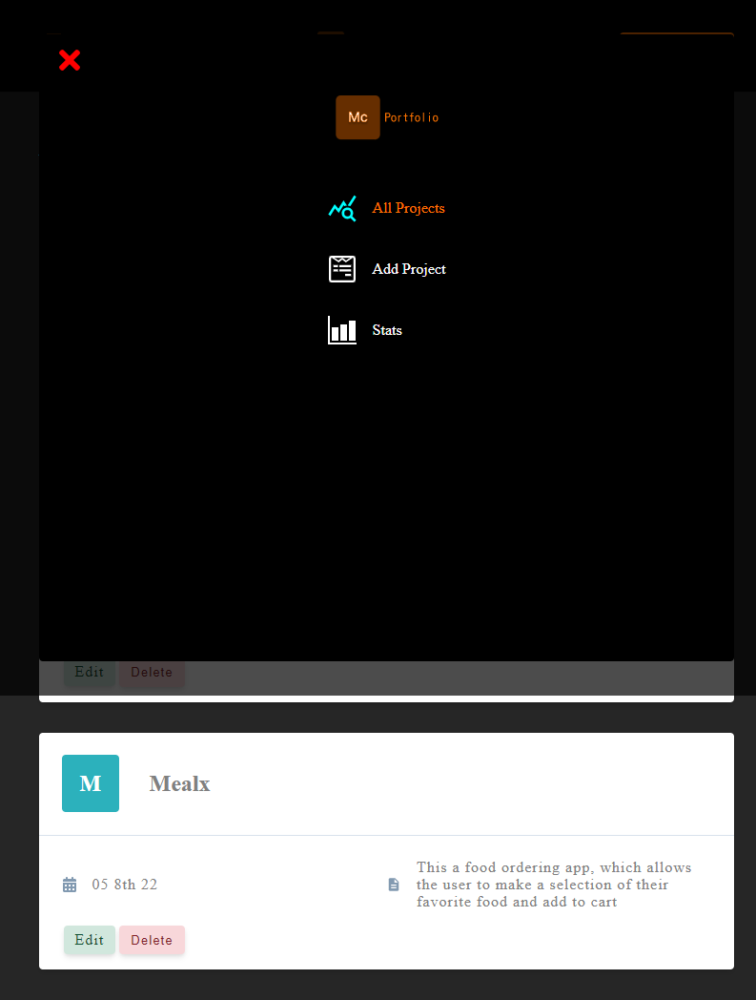
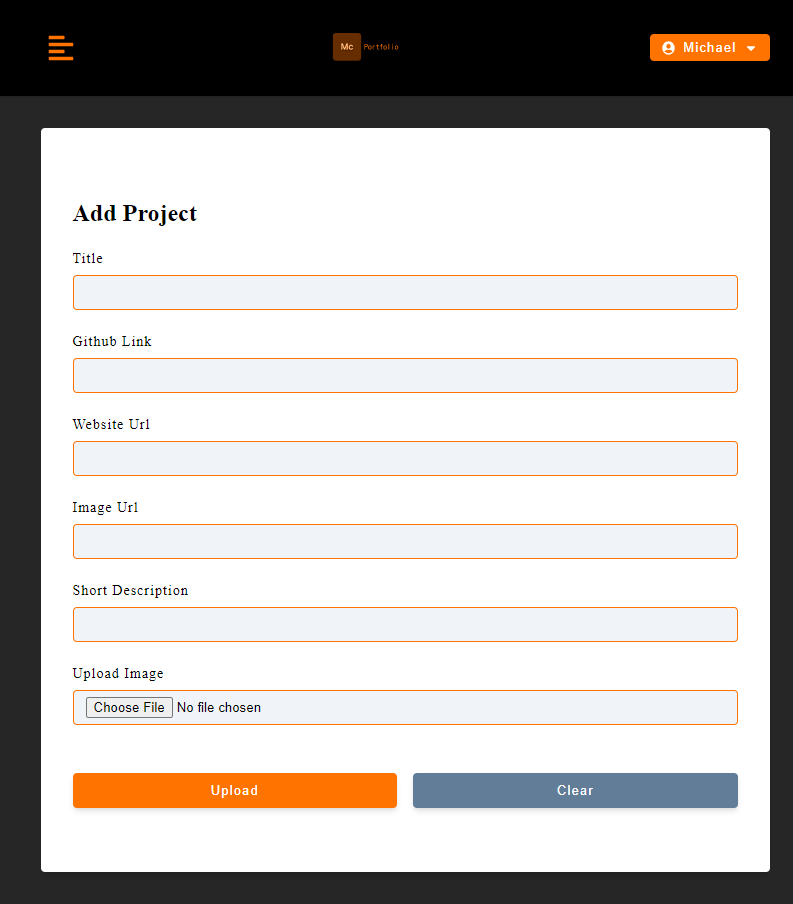

# My PortFolio Project

This project was bootstrapped was developed uisng the react library for the frontend and the backend was developed using 
Node.js(express framework) and the database using mongodb. This Portfolio project was done to aid my understand of the MERN
stack. The Portfolio project contains some of my project works, my tech stack skills and about me.

Here is a screenshot of the Landing page of my portfolio project

## About Page

The About page showcase who I am and what are my tech skills. Below is a screenshot of the about page of my portfolio project

## Project Page

The Project page display most of the projects that have worked on so far, each project card has two buttons, the 
github button that links to the project github repo and the site button that links to the project website. Below is a 
screenshot of the project page  of my portfolio project.

## Login Page

The Login page provide authentication functionality to the project. it provide protection to the admin page where I manage the
upload of new project, editing old project as well as deleting project. below is the screenshot of the Login page

## Admin Dashboard page

This is the page that allows for the easy management of the project. here one can easily upload new project, edit and delete old
projects, the screenshots below provide the desktop and mobile views of the dashboard page

### Desktop View

### Mobile view 

## Frontend Deployemnt to Netlify

The Portfolio project frontend was deploy to Netlify hosting platform as follows

    step 1: The Project was push to github
    
    step 2: From the Netlify dashboard click on the button add new site from git

    step 3: Link to Your GitHub (or supported version-control tool of choice) in my case Github
     
    step 4: Authorize Netlify to access your github account

    step 5: Select Your Repo in my case the portfolio_frontend repo

    step 6: Build Your Site

## Backend Deployment to Heroku

The portfolio project backend was deployed to Heroku hosting platform as follows

    step 1: Th Project was push to github from my local repo

    step 2: Then using the Heroku cli login to Heroku

    step 3: create the app using the command "Heroku create app-name"

    step 4: configure all environment variable using the command " Heroku config:set"

    step 5: push the project to heroku using the command "Heroku push origin master"

    wait for the project to build and a url to access the app will be displayed.

Click [Project Backend Repo](https://github.com/SmtOmega/Portfolio_Backend)